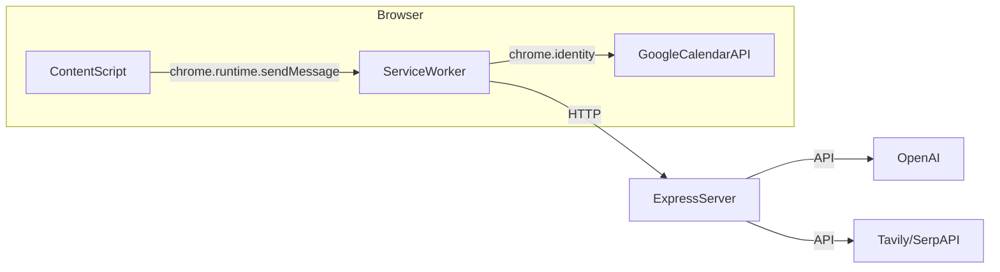

# Meeting Prep — Complete Functional Specification

## Overview

A Chrome extension for Google Calendar that adds a "Prep Meeting" button to event dialogs and the full-page editor. When clicked, it resolves participant identities (LinkedIn, company info) and generates a structured meeting preparation document. Prep is persisted so that re-opening a prepped meeting instantly shows the prep card.

## Repo Deliverables (So It Can Be Rebuilt From Blank)

The repo must contain, at minimum:

- **Extension**:
  - `manifest.json` (MV3): permissions (`identity`, `storage`), host permissions for Calendar + backend, content scripts registration for Calendar and Gmail surfaces, service worker registration.
  - `content.js`: injection + scraping + UI rendering.
  - `background.js`: OAuth + Calendar API + server API + caching + message router.
  - `options.html` + `options.js`: configure backend base URL and diagnostics.
  - UI assets (icons), and CSS strategy (inline style tag or bundled CSS).
- **Server**:
  - `server/server.js`: Express app with endpoints and middleware.
  - `server/persistence/`*: storage interface + dev adapter + Dynamo adapter.
  - `server/openai.js`, `server/resolvePerson.js`, `server/search.js`, `server/scorer.js`, `server/resolver.js`, `server/cache.js`.
  - `server/package.json` + lockfile, with scripts for dev/prod.
  - Documentation: env vars required (OpenAI key, Tavily/SerpAPI keys, Dynamo table name, dev file path), and a minimal deploy guide.

---

## Architecture Components

- **Content Script** (`content.js`): Runs on `calendar.google.com`. Injects UI, scrapes event details from the DOM, communicates with the background script via `chrome.runtime.sendMessage`.
- **Service Worker** (`background.js`): Handles all Google Calendar API calls (OAuth), all communication with the backend server, and all persistence logic. The content script never talks to the server or Calendar API directly.
- **Express Server** (`server/server.js`): Receives prep requests, resolves participants (via web search + OpenAI), generates the prep document, and caches results in memory.

## Server Implementation Requirements (What Must Exist)

The server implementation must include:

- **Persistence layer abstraction** with a single interface used by route handlers:
  - dev adapter: durable local storage (JSON file or SQLite)
  - prod adapter: DynamoDB
- **Authentication/tenanting** that derives a stable Google account identity from a token supplied by the extension, and scopes all reads/writes to that identity.
- **Deterministic data model** for:
  - meeting metadata (title, attendees)
  - generated prep sections
  - user edits/overrides
  - timestamps and versioning
- **Regeneration rules** (idempotency + info-change detection) so the server can decide reuse vs regenerate.
- **Operational requirements**:
  - structured logging for each request (eventId, user identity hash, latency)
  - safe handling of external API failures (OpenAI/search timeouts)
  - configuration via environment variables (API keys, Dynamo table name, dev file path)
  - CORS configured to allow the extension origin(s)

---

## Functional Requirements

### FR-1: "Prep Meeting" Button Injection

**Trigger**: Whenever the user opens a meeting event — either a quick-view popup dialog or the full-page event editor.

**Behavior**:

- A "Prep Meeting" button appears near the event's action area (close to Google Calendar's own Save/conferencing buttons).
- The button must work from **any Google Calendar UI surface**, including:
  - Google Calendar web app (large screen, small screen, responsive layouts)
  - The Google Calendar UI embedded in Gmail (sidebar / mini calendar surfaces)
  - Quick-view dialogs, full-page event editor, and any alternate editor variants Google rolls out
- The button placement and affordance should feel similar to the **Zoom meeting button** experience (same “belongs here” feel: consistent placement, size, typography, and interaction patterns).
- The button must appear for BOTH new (unsaved) meetings and existing (saved) meetings.
- The button must survive Google Calendar's frequent DOM re-renders (SPA navigation, dialog open/close).
- Only one button should be injected per event view — no duplicates.

### FR-1a: UI Quality, Theming, and Responsiveness

**Behavior**:

- The prep UI must look **professional** and consistent with Google Calendar’s UI patterns (Material-like conventions).
- Must support **light and dark mode** automatically based on the page’s current theme.
- Must support different viewport sizes:
  - large screens: right-side panel is acceptable
  - small screens: overlay modal / bottom sheet / full-height drawer (choose one) must be usable
- Must be accessible: keyboard navigable, appropriate ARIA labels, sensible focus behavior, and escape-to-close when applicable.

### FR-2: Prep Generation (New Meeting)

**Trigger**: User clicks "Prep Meeting" on any meeting (new or saved) that has not been prepped before, or whose info has changed.

**Behavior**:

- Scrape event details from the DOM: title, attendees (emails + display names), date/time, organizer.
- If a Calendar event ID is available (saved meeting), resolve the event via the Google Calendar API to get authoritative attendee data.
- Send the data to the server for prep generation.
- The server resolves each participant (name, LinkedIn, company, summary) and generates a structured prep document with sections: Participants Info, Meeting Agenda, Questions Before Meeting, Questions In Meeting.
- A loading shimmer card appears while generating. On success, a fixed-position prep card renders on the right side of the page.
- The organizer (the user themselves) should be excluded from the participant list sent for research.
- If the meeting has no title and no attendees, show a "needs input" message instead of generating.

### FR-2a: Extracting Participant Display Names (Must Be Robust)

**Goal**: Produce the best available `{ email, displayName }` per attendee, despite Google Calendar variability.

**Requirements**:

- The content script must extract attendee **emails** and **display names** from the UI wherever possible, using multiple strategies depending on surface:
  - attendee “chips” / guest list items (where names are visible)
  - `mailto:` links (extract email; derive display name from adjacent text or tooltip)
  - elements with `data-hovercard-id` (often contains email/identifier)
  - `aria-label` / `title` attributes that include `Name <email>` patterns
  - fallback: if only email is available, set `displayName` to the local-part temporarily
- When the Calendar API provides `attendees[].displayName` but it looks low-quality (e.g., equals the email local-part), the UI-scraped display name should override it.
- When the UI has a display name but no email (rare), do not invent an email; the attendee must still be represented as “unresolved” to the server.
- The background must merge DOM snapshot + Calendar API and send a normalized `participants[]` list to the server.

### FR-3: Prep Persistence and Retrieval

**Primary requirement**: Meeting prep must be durably persisted on the **server** and retrievable later by meeting ID, so reopening works **anytime, anywhere** (different tabs/windows/computers) for the **same Google account**.

**Behavior**:

- The system must persist prep **only for saved meetings** (meetings with a stable Google Calendar `eventId`).
  - Storing temporary/unsaved meeting prep is optional; it may be used as a UX optimization but is not required.
- Prep retrieval must be by a stable meeting identifier:
  - canonical ID: `calendarEventId` (Google Calendar event id)
  - server records must be namespaced by Google account identity (tenanting), so prep from one account is not accessible to another
- The server is the **source of truth** for persistence; client caching is optional.

### FR-4: Auto-Open Prep for Previously Prepped Meetings

**Trigger**: User opens/navigates to a saved meeting that has existing prep.

**Behavior**:

- When a saved meeting is opened, the service worker must check whether this meeting has already been prepared, **by meeting ID** (the Google Calendar `eventId`, namespaced to the same Google account).
- If it has not been prepared, do nothing (only show the button).
- If it has been prepared, the content script automatically opens the prep card — no button click needed.
- Auto-sync should be throttled/debounced to avoid flooding the server with GET requests on rapid DOM changes.
- If the user dismisses the prep card, it should not auto-reopen for the same event until the user navigates away and back.

### FR-5: Re-pressing "Prep Meeting" on an Already-Prepped Meeting

**Trigger**: User clicks "Prep Meeting" on a meeting that already has prep.

**Behavior**:

- If the meeting title and attendee list are unchanged, return the existing prep from the server.
- The check should compare the current title and sorted emails against the stored prep's title and emails.
- This must work regardless of whether the prep was originally generated in this session, a different tab, or a previous browser session.

### FR-6: Re-Prep After Editing Meeting Info

**Trigger**: User edits a meeting's title or attendees, then clicks "Prep Meeting".

**Behavior**:

- The changed title/emails will NOT match the stored prep, so the cache check fails and a fresh server POST is made.
- The server must also detect info changes — if it has cached prep for the same `eventId` but the title or emails differ, it must regenerate (not return stale prep).
- The newly generated prep overrides the stored prep.

### FR-7: User-Edited Prep Sections

**Trigger**: User manually edits text in the prep card's textarea sections and clicks "Save edits".

**Behavior**:

- User edits must be **persisted and durable**, so they can be viewed from any tab/window and on another computer for the same Google account.
- User edits must be saved on the **server** (not session-scoped).
- When the prep card renders, it must merge user edits on top of the latest generated prep (user edits win).
- The system must support updating individual sections (Participants Info / Agenda / Questions) without requiring full regeneration.
- The system must define how edits interact with regeneration (when meeting details change): preserve and re-apply where possible, otherwise mark edits as stale/conflicting and communicate this in the UI.

### FR-8: Unprepared Saved Meeting

**Trigger**: User opens a saved meeting that has never been prepped.

**Behavior**:

- The "Prep Meeting" button appears, but no prep card auto-opens.
- Auto-sync finds no prep (server 404), so it returns `skipped` and the content script does nothing.

### FR-9: Server Endpoints

The server must provide:

- **Auth/identity** middleware capable of identifying the Google account making the request (tenanting).
- `POST /manual-prep`: Generate prep for a meeting.
  - Must accept: `calendarEventId` (required to persist), `calendarId` (optional), `title`, `participants[]` (email + displayName), `organizerEmail`, `startIso`.
  - Must return: `{ ok, eventId, prep, emails, reused }`.
  - Must be idempotent per (googleAccount, calendarEventId) unless meeting info changed.
- `GET /get-prep/:eventId`: Fetch stored prep for a meeting (scoped to the authenticated Google account). Returns 404 if not found.
- `PUT /prep/:eventId/edits`: Persist user edits/overrides per section for this meeting.
- `GET /prep/:eventId/combined` (optional): Return generated prep merged with stored edits.
- `POST /resolve-person`: Resolve a single participant.
- `GET /health`: Health check.
- `POST /admin/clear-prep-cache`: Debug/admin cache clear.

### FR-9a: Server Persistence Implementation Requirements (Dev vs Prod)

**Durability goal**: Prep must persist across server restarts and be retrievable on another machine.

Requirements:

- The server must implement a persistence layer with two modes:
  - **Production**: DynamoDB.
  - **Development**: durable local store (JSON file or SQLite) with the same logical interface.
- Data model must support:
  - tenanting by Google account identity (e.g., `googleSub` or verified account email)
  - lookup by `calendarEventId`
  - storing generated prep, meeting metadata (title, attendee emails, timestamps), and user edits
  - versioning (`updatedAt`, optional `prepVersion`) and optional TTL cleanup policy

### FR-9b: Authentication and Tenanting (Same Google Account Only)

**Goal**: “Different computers/tabs” works, but prep is only accessible to the same Google account.

Requirements:

- The service worker must attach an identity proof to every server request (e.g., Google OAuth access token from `chrome.identity.getAuthToken`).
- The server must validate the token and derive a stable user identity (preferred: `sub`; acceptable: verified account email).
- All prep read/write operations must be scoped to that derived identity.
- If token validation fails, the server must reject the request (401/403) and the UI must show a clear error state.

### FR-10: Calendar Event Resolution

The background must robustly resolve which Google Calendar event the user is looking at:

- Try direct `events.get` with candidate event IDs against the user's calendars.
- Fall back to `events.list` with title search, time window, and attendee matching.
- Use the DOM-scraped snapshot (start time, attendee emails) to narrow the search and avoid false matches (e.g., two meetings with the same title on different days).
- For unsaved/new meetings, Calendar API resolution may return nothing — this is fine. The prep still works using DOM-scraped data only.

---

## Supported User Scenarios (Complete Matrix)

- **Scenario_1_NewMeetingPrepWorks** (פגישה חדשה + תכנון פגישה עובדת): New unsaved draft meeting + pressing “Prep Meeting” generates and shows prep.
- **Scenario_2_PreppedMeetingAutoOpens** (פגישה שתוכננה - כשנכנסים אליה, רואים את התכנון קופץ ישר): Opening a saved meeting that already has prep auto-opens the prep panel.
- **Scenario_3_UserEditsPersistEverywhere** (ניתן לערוך תכנון פגישה והוא נשמר לאורך סשנים): Edits are saved on the server and are visible across tabs/windows and on another computer for the same Google account.
- **Scenario_4_SavedMeetingNoPrepDoesNothing** (פגישה שלא תוכננה ושמורה, עובדת כרגיל): Opening a saved meeting without prep does not auto-open anything.
- **Scenario_5_PrepSavedMeetingWorks** (ניתן לתכנן גם פגישה שמורה): Pressing “Prep Meeting” on a saved meeting generates and shows prep, and persists it.

---

## Lessons Learned and Best Practices

### What Failed Previously

1. **Hooking Google Calendar's Save button**: Attempted to detect clicks on the native Save button to trigger persistence. Failed because Google Calendar aggressively re-renders its UI, destroying event listeners even when using event delegation. This approach is fundamentally fragile — never rely on detecting clicks on UI elements you don't control.
2. **In-memory Maps in MV3 service workers**: Used `Map` objects in the service worker to store pending prep data. MV3 service workers terminate after ~30 seconds of inactivity, wiping all in-memory state. Any data that must survive beyond a single message handler execution must be in a persistent store.
3. `**chrome.storage.session` for prep data**: While better than in-memory (survives SW restarts within a session), it is still too ephemeral for prep data that users expect to persist across browser restarts and across tabs.
4. **Tab-based keying**: Keyed pending prep by tab ID. This breaks when the user navigates within a tab, opens the same event from a different tab, or when the service worker restarts and loses tab context.
5. **Depending on Calendar API timing**: After the user clicks Save on a new event, the Calendar API may not immediately index the new event. Retry loops with `setTimeout` in a service worker are unreliable because the SW can terminate between retries.
6. **Complex multi-step persistence chains**: The flow of "generate prep -> store pending -> detect Save click -> resolve Calendar event with retries -> POST to server" had too many failure points. Each link in the chain could independently fail, making the overall reliability very low.

### Best Practices to Follow

1. **Server-side persistence is the source of truth**: If prep must be available on another computer, it must be persisted in a durable server datastore (DynamoDB in prod).
2. **Use client-side caching only as an optimization**: `chrome.storage.local` may improve performance/availability but must not be required for correctness across devices.
3. **Don’t rely on third-party UI events for critical persistence**: Avoid chains that depend on detecting Google Calendar’s Save click.
4. **Never hook third-party UI elements for critical logic**: DOM observation is fine for injecting your own buttons, but critical persistence paths must never depend on detecting clicks on elements controlled by the host page.
5. **Keep the content script thin**: It should only scrape the DOM and render UI. All persistence logic, API calls, and caching decisions should live in the background script.
6. **Idempotent server endpoints**: The server's `/manual-prep` should return cached results for identical input, unless meeting info changed.
7. **In-memory SW state is ephemeral helpers only**: Throttle maps are fine as optimizations, but the system must work correctly even if they are all empty after SW restart.

